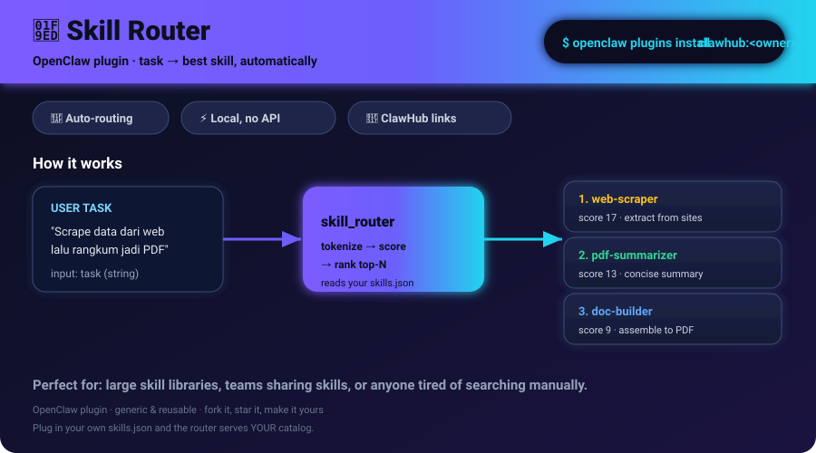

# 🧭 Skill Router — Plugin OpenClaw



> **"Lo punya banyak skill di ClawHub… tapi tiap kali ngerjain sesuatu, skill mana yang harus dipakai?"**

Skill Router menjawab itu. Kasih dia deskripsi tugas, dia balikin **skill terbaik dari katalog lo** lengkap dengan alasan + link ClawHub. Gak perlu ingat nama skill satu-satu.

---

## ✨ Kenapa ini berguna (umum)

- 🗂️ **Katalog skill tebal** — kalau lo punya puluhan skill, model gak selalu tau mana yang pas buat tugas tertentu.
- 🎯 **Routing otomatis** — dari tugas natural language → rekomendasi skill yang di-rank by relevansi.
- 🔗 Tiap rekomendasi langsung kasih **link ClawHub** biar gampang dibuka/di-install.
- ⚡ Jalan di dalam OpenClaw sebagai agent tool — model bisa panggil sendiri pas butuh.

Cocok buat: *skill library pribadi, tim yang bagi-bagi skill, atau siapa pun yang males nyari manual di antara banyak skill.*

---

## 📦 Instalasi

```bash
# dari ClawHub (setelah publish public)
openclaw plugins install clawhub:<owner>/openclaw-skill-router

# atau dari lokal (path folder plugin)
openclaw plugins install /path/ke/skill-router --force
```

Restart gateway biar plugin ke-load:

```bash
openclaw gateway restart
```

Cek status:

```bash
openclaw plugins inspect skill-router --json
```

---

## 🛠️ Cara pakai

Plugin mendaftarkan satu tool: **`skill_router`**.

| Parameter | Tipe | Wajib | Keterangan |
|-----------|------|-------|------------|
| `task` | string | ✅ | Deskripsi tugas yang mau lo kerjain |
| `limit` | number | ❌ | Berapa rekomendasi (1–10, default 3) |

### Contoh pemanggilan (dari dalam chat OpenClaw)

> **Lo:** "Aku mau nge-scrape data dari web terus rangkum jadi PDF"
>
> **Model** (lewat `skill_router`) balikin:
>
> ```
> Top 3 skill(s) for: "scrape web lalu rangkum jadi PDF"
>
> 1. Web Scraper (web-scraper) — score 17
>    Extract structured data from any website...
>    https://clawhub.ai/<owner>/web-scraper
>
> 2. PDF Summarizer (pdf-summarizer) — score 13
>    Turn long documents into concise summaries...
>    https://clawhub.ai/<owner>/pdf-summarizer
>
> 3. Doc Builder (doc-builder) — score 9
>    Assemble summaries into formatted PDFs...
>    https://clawhub.ai/<owner>/doc-builder
>
> Total catalog size: 42 skills.
> ```

Gak ada match kuat? Dia arahin lo ke **orchestrator skill** (kalau ada di katalog) buat gabungin beberapa skill sekaligus.

---

## 🧩 Gimana ini kerja (simpel)

1. Saat plugin load, dia baca `skills.json` — snapshot katalog skill lo (nama, slug, deskripsi).
2. Pas `skill_router` dipanggil, dia tokenize tugas lo, score tiap skill by overlap kata kunci + phrase match di deskripsi.
3. Return top-N ranked + link.

Gak ada network call, gak ada API eksternal — **semua lokal**, cepat & privasi aman.

---

## 📁 Struktur repo

```
skill-router/
├── package.json          # metadata + peerDep openclaw
├── openclaw.plugin.json  # manifest plugin (id, contracts, activation)
├── skills.json           # snapshot katalog skill lo
├── dist/
│   └── index.js          # entry point (registerTool: skill_router)
└── src/
    └── index.ts          # source TypeScript (referensi)
```

---

## 🔄 Update katalog

`skills.json` di-generate dari workspace lo. Kalau nambah skill baru, regenerate lalu commit + push + re-publish.

---

## ⚠️ Catatan

- Tool ini **optional** secara default — model cuma pakai kalau lo enable di `tools.allow`.
- Plugin **gak lewat SkillSpector** (itu khusus skill), jadi gak kena flag keamanan kayak skill.
- Butuh OpenClaw `>=2026.3.24-beta.2`.
- Ganti `<owner>` di contoh dengan handle ClawHub lo.

---

## 📜 Lisensi

Bebas dipakai & dimodif buat kebutuhan lo.

---

_Dibuat sama Clara ✨ · 2026-08-27_
